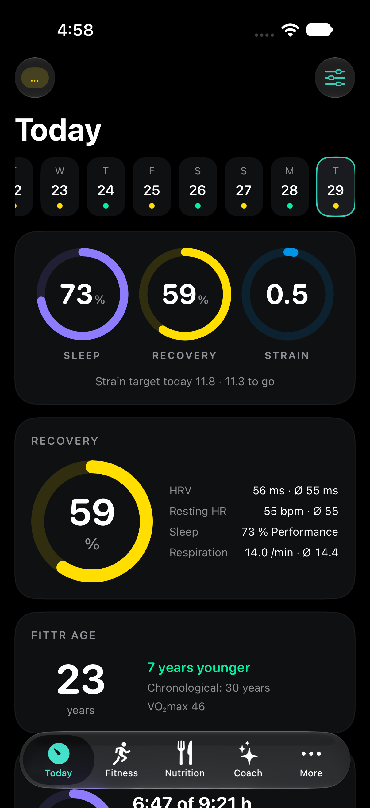
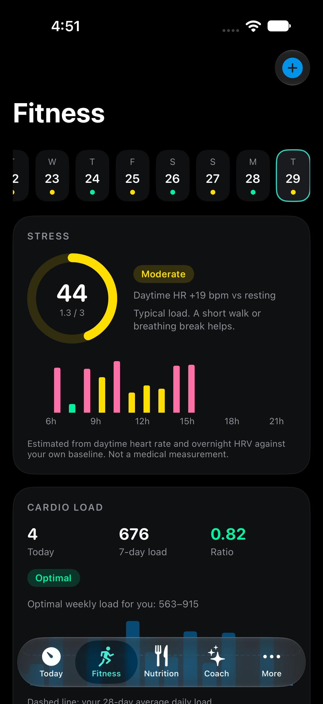
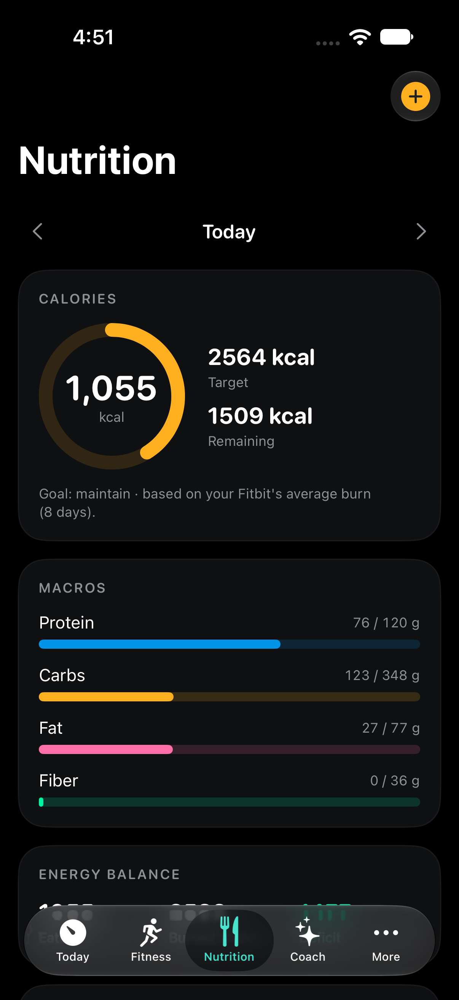
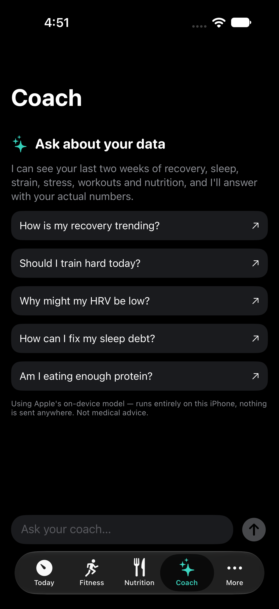

# Fittr — a private recovery, fitness and nutrition tracker for the Fitbit Air

[](LICENSE)


Fittr is a private iOS app that reads your **Google Fitbit Air** data through the
new **Google Health API** and turns it into daily readiness metrics — recovery,
strain, sleep, stress and a biological "Fittr Age" — plus nutrition and workout
logging and an AI coach. Everything is computed on device against your own baseline.
No server, no subscription, no tracking.

> **Not affiliated with Google, Fitbit, Apple, Anthropic or WHOOP.** See
> [Disclaimer](#disclaimer). Licensed under **Apache-2.0**.

<p align="center">
  
  
  
  
</p>

<p align="center"><sub>Today · Fitness · Nutrition · Coach — demo data.</sub></p>

> **No Fitbit at hand? Just want a look?** Build it and tap **Demo mode** on the
> welcome screen: 120 days of realistic sample data, no Google account, no setup.
> That is what the screenshots above show.

## What it does

- **Recovery score (1–99 %)** — from HRV, resting heart rate, sleep performance and
  respiration, each scored against your personal 30-day baseline.
- **Strain (0–21)** — cardiovascular daily load (Banister TRIMP from heart-rate-reserve),
  including strain per workout.
- **Sleep** — need, debt, performance, a composite sleep score and consistency, with a
  phase hypnogram.
- **Stress (0–100)** — estimated from daytime heart-rate elevation and overnight HRV,
  with an hourly profile.
- **Cardio load** — 7-day vs 28-day workload ratio with an optimal weekly range.
- **Workout log** — log runs, rides, HIIT and **strength sessions with sets, reps and
  weight** (estimated 1RM, volume); manual workouts feed strain and cardio load.
- **Nutrition** — food log with calories and macros, targets from your Fitbit's measured
  energy burn, energy balance, and optional **AI meal estimates from text or a photo**.
- **AI coach** — chat about your own data with Apple's free on-device model (no key), or
  optionally Claude with your own API key.
- **Health Monitor** — resting HR, HRV, respiration, SpO₂ and skin temperature shown
  inside your personal baseline band (± 1.65 SD) with a warning status.
- **Fittr Age** — a conservative biological-age estimate from VO₂max, HRV, resting HR,
  sleep and activity (bounded to ±15 years of your real age).
- **Trends** — recovery vs. strain, sleep, HRV and resting HR over 7 / 30 / 90 days.
- Daily activity totals from the Fitbit: steps, distance, floors, active zone minutes,
  energy burned.

The app is English-only, black-themed, and all data stays **local on the iPhone** (JSON in
Application Support). No account on any server, no analytics. The only network calls are
to Google Health, and — only if you choose Claude as the AI engine — the Anthropic API.

## Why the Google Health API (not the Fitbit Web API)?

The classic **Fitbit Web API is being shut down in September 2026**. Google is
replacing it with the **Google Health API** (`health.googleapis.com/v4`, OAuth 2.0).
The Fitbit Air already syncs into the **Google Health app**, so Fittr is built
directly against the new API. Because it is new (v4, launched May 2026) and not every
field name is finalized, Fittr decodes **tolerantly** (candidate keys, read-variant
fallback) and logs every metric individually in an in-app **sync log** — a single
missing data type never blocks the rest.

## How the scores are built (in short)

- **Recovery** weights HRV 40 % · resting HR 25 % · sleep 25 % · respiration 10 %,
  each as a z-score vs. your 30-day baseline through a logistic curve; zones follow
  Whoop (≥ 67 green, 34–66 yellow, < 34 red). Missing components are re-weighted.
- **Strain** sums Banister TRIMP (exponentially intensity-weighted minutes above 30 % of
  heart-rate reserve) and maps it to 0–21 (`21 × (1 − e^(−load/160))`).
- **Stress** compares daytime heart-rate elevation and overnight HRV with your own baseline.
- **Cardio load** is the 7-day : 28-day workload ratio (0.8–1.3 is the sweet spot).
- **Fittr Age** starts from your real age and moves it by shrunk, capped deviations from
  VO₂max (FRIEND norms; the strongest single mortality predictor, Mandsager 2018), HRV,
  resting HR, sleep and steps — never more than ±15 years. It is an orientation, not a
  medical result.

The full methodology, sources and the Google Health data-type mapping live in
[`SETUP.md`](SETUP.md).

## Build it

Requirements: an iPhone on iOS 17+ with the Google Health app (Fitbit Air paired) and
Xcode 16+. (`xcodegen` is optional; without it, `Tools/add_sources.py` registers new files
in the project.)

```bash
open Fittr.xcodeproj      # NOT the folder or Package.swift — pick the "Fittr" scheme
```

In Xcode: target **Fittr** → *Signing & Capabilities* → your personal team (a free
Apple ID is enough) → connect the iPhone → ▶︎ Run. In the app, tap **Connect Google
Health**, paste your OAuth client ID (iOS client, bundle id `com.fittr.app`,
PKCE — no client secret), sign in, done. No Google setup? Start **Demo mode** for 120
days of realistic sample data.

> **Bring your own Google Cloud project.** There is no shared backend or API key in
> this repository — Fittr uses PKCE and stores nothing server-side. Every user
> creates their own Google Cloud project and iOS OAuth client and stays subject to
> Google's API terms. The one-time setup (project, scopes, iOS client id) is
> documented step by step in [`SETUP.md`](SETUP.md).

## Project structure

```
fittr/
├── Fittr.xcodeproj   # generated project — open this to build
├── project.yml       # xcodegen definition (regenerate only after changes)
├── App/              # iOS: SwiftUI, OAuth browser flow, assets, the widget host
├── Core/             # platform-neutral: models, metric engines, API client, sync
│   └── Package.swift # exposes Core as a library for the self-tests
├── FittrWidget/      # home-screen recovery-ring widget (App Group)
└── SelfTest/         # standalone SwiftPM package
```

Run the self-tests without Xcode (PKCE against the RFC-7636 vector, DTO decoding with
Google Health fixtures, every metric engine end-to-end on demo data, store roundtrip):

```bash
cd SelfTest && swift run fittr-selftest
```

## Roadmap

- Apple Watch complication
- Webhook subscriptions instead of polling
- Export (CSV / Health Connect)

## Contributing

This is a personal hobby project, shared in the hope it's useful, and **feedback is
genuinely welcome**. It's early, so you *will* find rough edges.

**Found a bug or a number that looks wrong?**
[Open an issue](../../issues/new/choose). A screenshot helps, and for sync problems the
matching line from the in-app **sync log** (*More → Sync log*) usually pins down the fix
on its own.

**Pull requests** are welcome too. Run the self-tests first
(`cd SelfTest && swift run fittr-selftest`); CI runs the same command on every push.

Details, ground rules and what to include: [`CONTRIBUTING.md`](CONTRIBUTING.md).
Release history: [`CHANGELOG.md`](CHANGELOG.md).

## Disclaimer

- **Not a medical device.** Fittr is for personal, informational use only. The
  scores (recovery, strain, sleep, Fittr Age, health monitor) are orientations, not
  diagnoses. They are not validated against clinical standards and must not be used
  to make medical decisions. If you feel unwell, talk to a doctor, not an app.
- **No affiliation.** WHOOP is a trademark of WHOOP, Inc.; Google, Fitbit and Google
  Health are trademarks of Google LLC; Apple and Apple Intelligence are trademarks of
  Apple Inc.; Claude and Anthropic are trademarks of Anthropic, PBC. This project is independent and not
  affiliated with, endorsed by or sponsored by any of them. Product names are used
  purely descriptively. The metric methodology is built from publicly published
  research (cited in [`SETUP.md`](SETUP.md)), not from any company's
  proprietary algorithms.
- **No warranty.** Provided "AS IS", without warranty of any kind (see the License).

## License

Licensed under the **Apache License 2.0** — see [`LICENSE`](LICENSE) and
[`NOTICE`](NOTICE). Apache-2.0 is permissive (use, modify and redistribute freely,
including commercially) and adds an explicit patent grant and a trademark clause.
